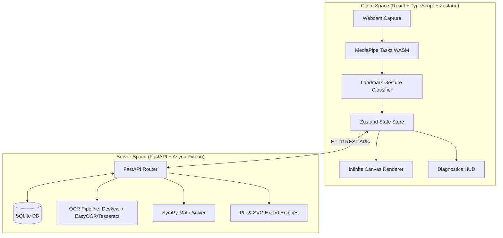
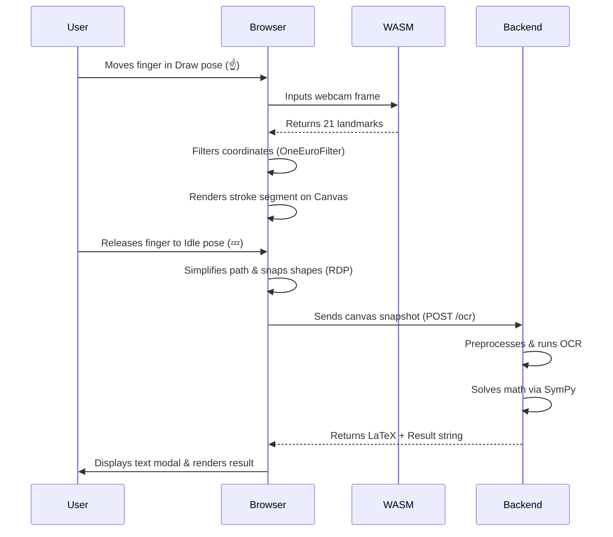
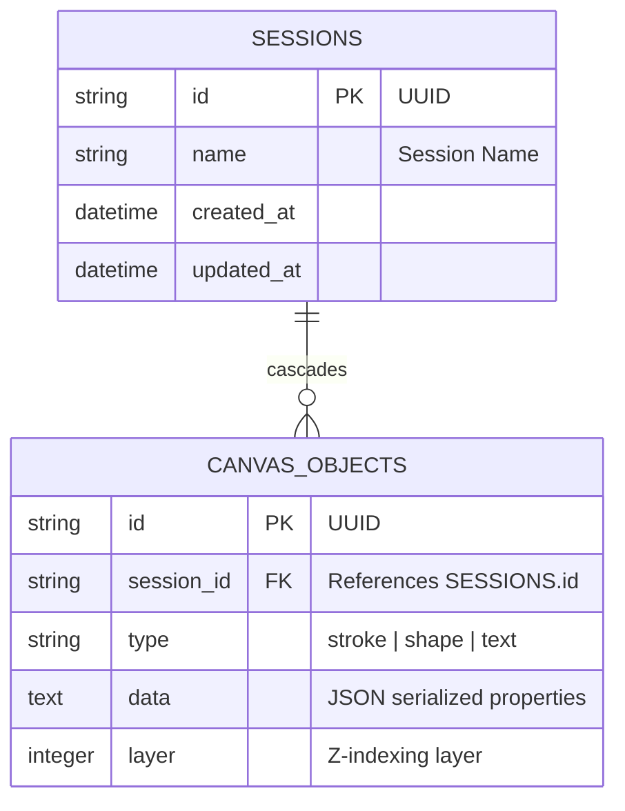

# AI-Powered AR Whiteboard

A production-quality, touchless **AR Whiteboard** that allows users to write, draw, and interact in the air using only their index finger. Real-time hand tracking runs directly in the browser via **MediaPipe WebAssembly**, achieving a buttery-smooth **60 FPS** on standard webcams. The client coordinates with a **FastAPI backend** for heavy-lifting services like SQLite session storage, handwriting OCR, LaTeX equation parsing, and high-fidelity file exports.

---

## 🚀 Key Features

*   **Touchless 60 FPS Drawing:** Uses browser-side MediaPipe Tasks (WASM) to extract 21 3D hand coordinates with zero network latency.
*   **Adaptive Jitter Smoothing:** Implements an adaptive speed **OneEuroFilter** and 1D **Kalman Filter** to eliminate hand tremor while retaining drawing accuracy.
*   **AI Shape Snapping:** Real-time heuristic classifier (using Ramer-Douglas-Peucker simplification) that converts messy sketches into perfect geometric shapes (rectangles, circles, triangles, arrows, and lines).
*   **Object-Based Infinite Canvas:** Vector-based canvas (like Figma/Excalidraw) supporting panning, zooming, dot grids, full undo/redo stacks, and element selection/drag manipulation.
*   **LaTeX Equation Recognition:** OCR pipeline that extracts handwritten equations, renders standard LaTeX notation, and solves calculations symbolically using **SymPy**.
*   **SQLite Session Manager:** Complete session CRUD pipeline to save, list, restore, and delete projects.
*   **Multi-Format Exporting:** Instantly download drawings as vector **SVG**, printable **PDF**, raster **PNG/JPEG**, or backup **JSON** session files.
*   **Developer Diagnostics Overlay:** Unreal Engine-style HUD showing render FPS, tracking FPS, WASM latency, API round-trip times, and server CPU/memory load.
*   **Dual Mode Input:** Fully supports fallback mouse drawing, stylus inputs, and touchscreens.

---

## 📐 System Architecture

### Component Diagram



### Action Sequence Flow



---

## ✊ Gesture Control System

Our gesture engine translates finger curling angles and joint distances into functional canvas controls. To support different hand shapes and distances, use the **Hand Calibration** settings panel on first load.

| Gesture | Pose | Action |
| :--- | :--- | :--- |
| **Idle** | 💤 Fist or folded hand | Pauses drawing and tracking |
| **Draw** | ☝️ Index finger up, others folded | Starts drawing freehand or shapes |
| **Eraser** | ✋ All 5 fingers extended | Erases objects intersecting palm |
| **Undo** | 🤙 Thumb and pinky extended | Pops the last stroke from history |
| **Redo** | 🤟 Thumb, index, and middle extended | Restores the last popped stroke |
| **Clear** | ✊ Closed fist held for 2 seconds | Clears the entire canvas |
| **Save** | ✌️ Victory sign held for 2 seconds | Saves active session to SQLite |
| **OCR** | 👌 OK sign (thumb + index touch) | Solves math and extracts text |
| **Pinch** | 🤏 Thumb and index tips touching | Selection Mode: Drag elements around |
| **Size** | 🤏 Pinching over canvas | Distance controls active brush width |

---

## 🗄️ Database Schema (ERD)

Whiteboard elements are serialized to JSON representations and stored in an SQLite database:



---

## 🔌 API Endpoints

The FastAPI backend exposes the following REST routes:

*   `GET /status`: Returns server health, CPU usage, memory utilization, and active feature flags.
*   `GET /settings`: Returns server defaults and engine configs.
*   `GET /sessions`: Lists all saved session metadata.
*   `GET /sessions/{session_id}`: Retrieves canvas objects for a session.
*   `DELETE /sessions/{session_id}`: Removes session and children.
*   `POST /save`: Saves or updates session canvas layers.
*   `POST /ocr`: Runs handwriting OCR and math solving on base64 image masks.
*   `POST /export`: Generates binary downloads (PNG, JPEG, SVG, PDF).

---

## 🛠️ Setup & Installation

### Option A: Running with Docker Compose (Recommended)

Make sure you have [Docker](https://www.docker.com/) and Docker Compose installed.

1.  Clone this repository:
    ```bash
    git clone https://github.com/yourusername/ar-whiteboard.git
    cd ar-whiteboard
    ```
2.  Launch the unified application:
    ```bash
    docker compose up --build
    ```
3.  Access the whiteboard at **`http://localhost:8000`**. The SQLite database is created in the root folder as `ar_whiteboard.db`.

### Option B: Native Local Installation

#### 1. Backend Setup (FastAPI)
Requires Python 3.12+ and system-level **Tesseract OCR** (optional, recommended).
1.  Navigate to the backend:
    ```bash
    cd backend
    ```
2.  Install dependencies:
    ```bash
    pip install -r requirements.txt
    ```
3.  Start Uvicorn from the **project root** directory:
    ```bash
    uvicorn backend.app:app --reload --port 8000
    ```

#### 2. Frontend Setup (React + Vite)
Requires Node.js 18+.
1.  Navigate to the frontend:
    ```bash
    cd frontend
    ```
2.  Install dependencies:
    ```bash
    npm install
    ```
3.  Start development server:
    ```bash
    npm run dev
    ```
4.  Open your browser to **`http://localhost:5173`**.

---

## 🧪 Automated Testing

Run backend tests using `pytest`:
```bash
# In the project root directory
pytest
```
Tests cover:
*   Asynchronous database CRUD operations (`tests/test_db.py`)
*   SymPy LaTeX conversion and symbolic equation solutions (`tests/test_ocr.py`)
*   FastAPI endpoints routing and file formatting (`tests/test_api.py`)

---

## 📈 Performance Benchmarks

*   **Hand Tracking Latency:** ~8-12ms on Apple Silicon / modern Intel CPUs (running WebAssembly GPU delegate).
*   **Drawing Smoothness:** Native 60 FPS viewport rendering.
*   **Backend Memory Footprint:** < 180MB at idle.
*   **Server CPU Usage:** ~1-3% during live drawing (tracking is client-side).
*   **OCR Round-trip Latency:** ~250-400ms (processing + math evaluation).

---

## 📄 License

This project is licensed under the MIT License - see the LICENSE file for details.
